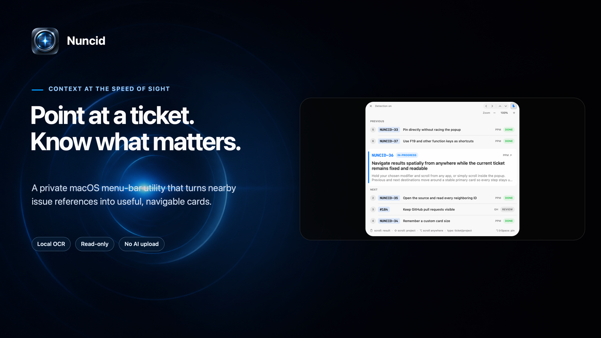
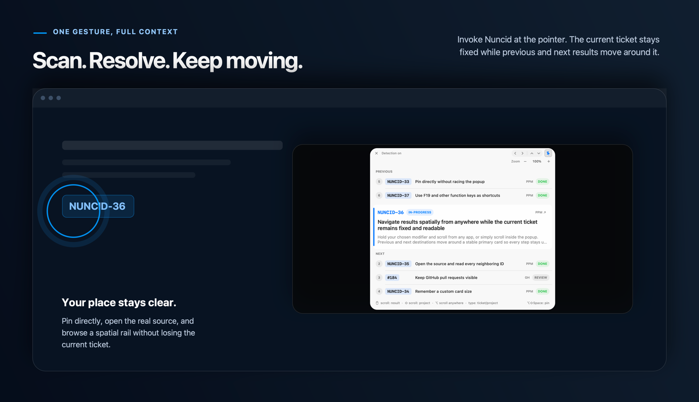
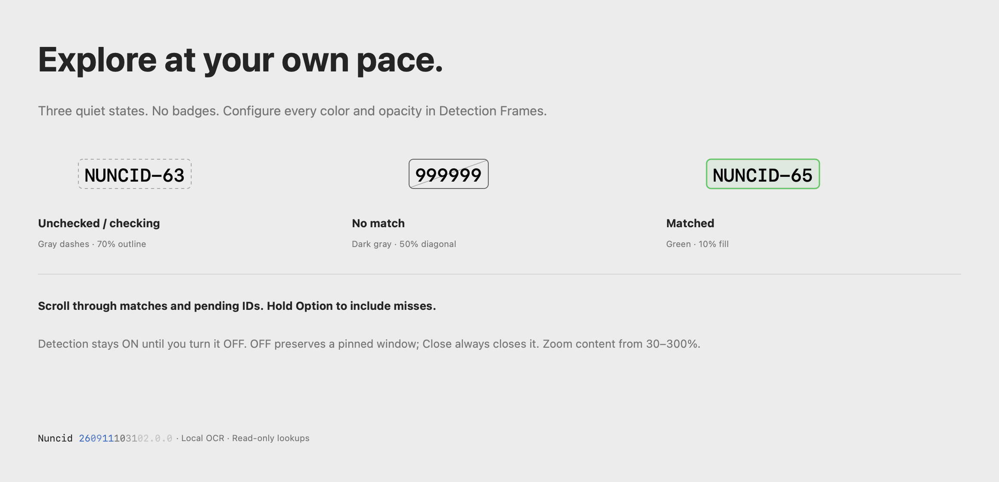
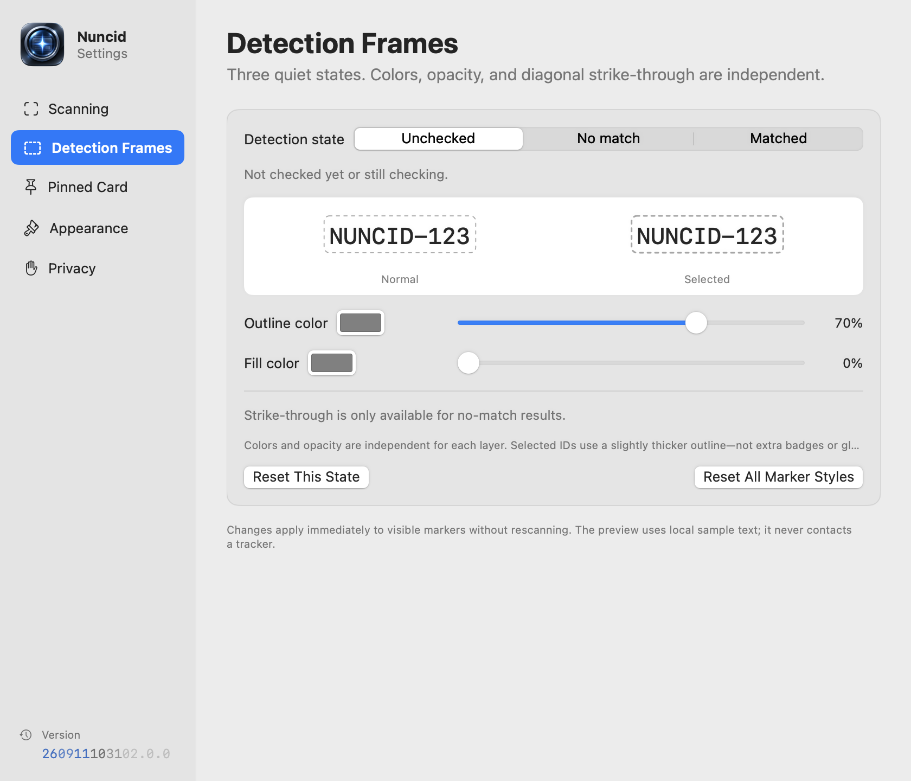
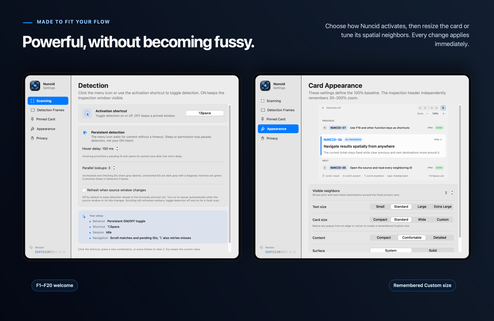
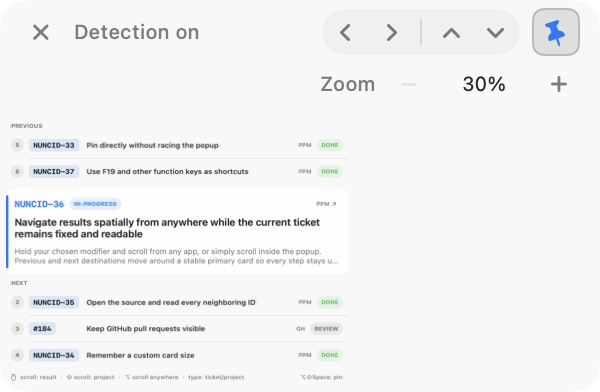
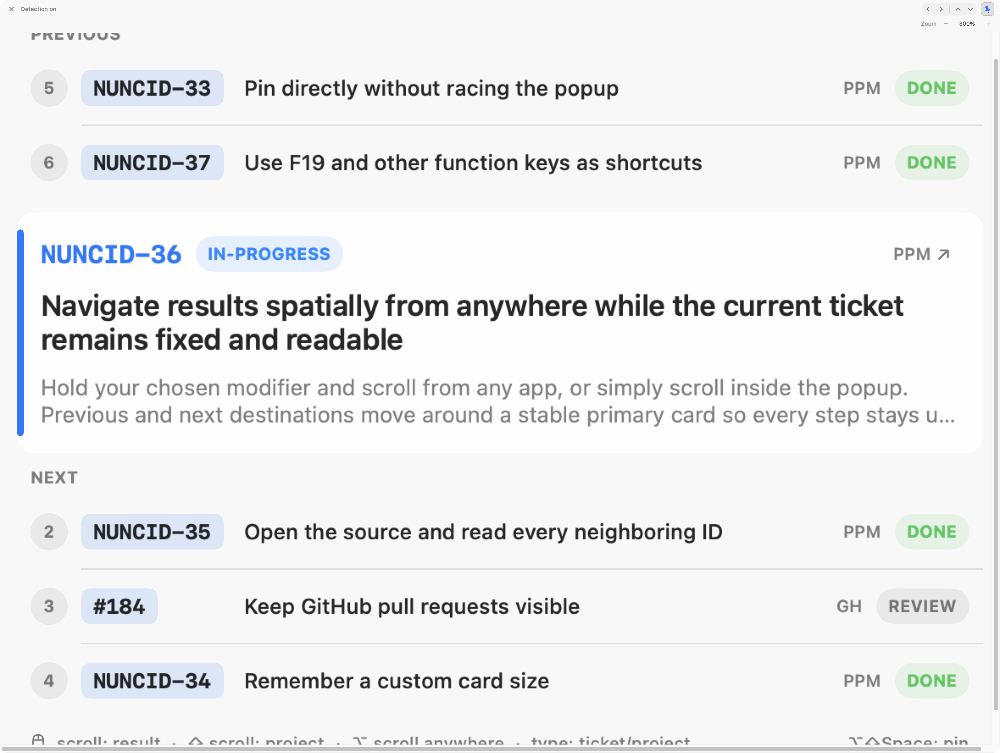
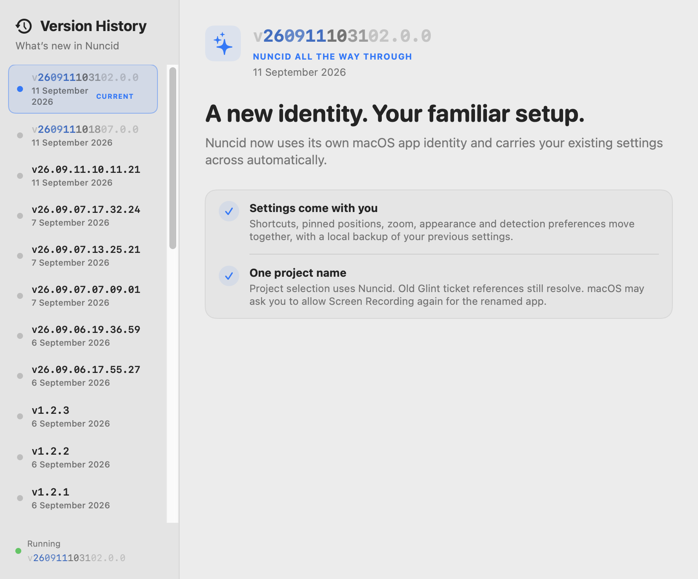
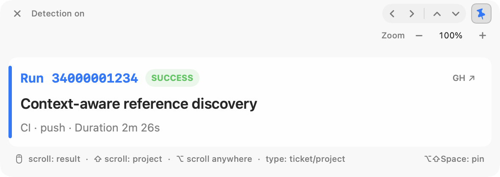

<p align="center">
  
</p>

<p align="center">
  <a href="https://github.com/markus-barta/nuncid/releases/latest"></a>
  
  
  
  
  <a href="LICENSE"></a>
</p>

<p align="center">
  <strong>Ticket context, right where you point.</strong><br>
  <strong>Nuncid</strong> (pronounced <strong>NUN-sid</strong>) is a private macOS menu-bar utility that turns nearby issue references into useful, navigable cards.
</p>

<p align="center">
  <a href="https://github.com/markus-barta/nuncid/releases/latest"><strong>Download the latest release</strong></a>
  &nbsp;·&nbsp;
  <a href="#build-from-source">Build from source</a>
  &nbsp;·&nbsp;
  <a href="CHANGELOG.md">Release history</a>
</p>

## Look once. Keep moving.

Click Nuncid or use the activation shortcut to toggle **detection ON/OFF**. ON immediately opens an inspection window and keeps it visible. Apple Vision discovers ticket references progressively outward from the pointer over the invoked display. Nearby candidates resolve first through your existing Paimos and GitHub sessions; hovering prioritizes a pending ID and opens its cached card. OFF stops automatic discovery and reads.

<p align="center">
  
</p>

| Invoke anywhere | Keep context nearby | Navigate without friction |
| --- | --- | --- |
| The **activation shortcut** and menu icon toggle detection. A menu invocation waits for content, without a timeout. | ON always keeps the window visible. OFF closes an unpinned window but preserves a pinned one, including cached navigation and manual entry. Unpinning while OFF closes it. | Normal scrolling includes matches and pending IDs. **Option + scroll** includes misses and deliberately retries them. Magnified overflow scrolls natively; use header arrows or the global scroll modifier to browse results. |

All visible candidates use three quiet frame styles—no status badges:

- **Unchecked / checking:** gray dashed outline, 70% opacity.
- **No verified match:** dark-gray outline with a diagonal strike-through at 50% opacity.
- **Verified Paimos or GitHub match:** green outline with a 10% green fill.

The selected source uses a slightly thicker outline, without changing your configured opacity or adding glow. Frames have 3 extra screen points of headroom at the top; the bottom edge and OCR coordinates stay fixed.

When you scroll, every row follows one continuous direction while the ticket key and first title line travel between NEXT, the fixed card, and PREVIOUS. Long titles remain on one line while moving, then reveal their wrapped lines after landing—so the card never jumps.

Pinned and unpinned windows have exactly the same header and controls. Close is at the left; project/result arrows and the permanent pin sit at the right. The unpinned pin is a gray ghost button; the pinned pin is tilted and pressed in. Pinning never rearranges the window.

## Every card points back to its source

The active source remains emphasized for as long as its card is visible. All candidates are marked during exploration—there is no pinned-only visibility switch. A pending selection shows “Checking…” rather than inventing ticket content.

<p align="center">
  
</p>

Markers ignore mouse input, do not animate, and remain excluded from screen capture. Source scrolling or Space changes invalidate stale coordinates immediately. After a short settling delay, Nuncid rediscovers visible IDs and reanchors their markers while keeping the card and cached results. **Refresh when source window changes** in Detection settings is off by default, including after upgrades: changing terminal/TUI window titles no longer repeatedly restart discovery. Enable it to rescan on source-window changes, or toggle detection off and on for a fresh scan. Off-screen IDs lose only their outline after refresh.

## Your shortcuts. Your card.

Left-click the menu icon to **turn detection ON**: the window appears immediately, then scanning waits until you leave the menu bar and pause over content for 0.35 seconds or click it. Menu-bar numbers never become the target, and the wait does not expire. A second left-click turns detection OFF. Right-click still opens the menu without changing detection. Target clicks pass through, so hover over links you do not want to activate. The shortcut uses the same toggle and starts at the pointer when it is over eligible content.

Detection settings expose the shortcut, **hover delay (default 100 ms, 0–500 ms)** and **parallel lookups (default 3, 1–5)**. Existing shortcuts and unrelated preferences survive migration; an old Off mode leaves the shortcut disabled. Close stops detection and closes even a pinned window. Escape clears active text entry first; otherwise it turns detection OFF while respecting pin. Typing, scrolling, no-match results and completed discovery never disable detection. Sleep or permission loss pauses work; ON intent survives and resumes with fresh geometry. App launch starts OFF. Settings apply immediately, and appearance previews use only local sample data.

**Detection Frames** settings configure each state's outline color/opacity and fill color/opacity. Strike-through is available **only for no-match results**, with its own on/off toggle, color, and opacity. Pending/checking and verified matches never have a diagonal, even if older saved settings enabled one. Changes update visible markers immediately—without OCR or tracker requests. A local preview shows normal/selected frames; reset one state or all marker styles without resetting other preferences.

<p align="center">
  
</p>

| Idle | Exploring | Ticket found |
| --- | --- | --- |
|  |  |  |

<p align="center">
  
</p>

Nuncid can show zero to six neighboring destinations and offers four text sizes, three presets plus a remembered Custom size, three content densities, and system or solid surfaces. These appearance settings define the **100% baseline**. The header’s **− / percentage / +** controls independently remember **30–300% zoom**, in 10-percentage-point steps; click the percentage to reset to 100%. Content, icons and spacing magnify together. The header stays at native size so controls remain usable at 30%. The window cannot exceed its current display’s usable area; oversized content scrolls horizontally and vertically using native macOS behavior. Dragging/resizing and changing displays do not bake zoom into the saved baseline.

<p align="center">
  
  
</p>

## What changed—and why it feels better

The app’s **Version History** explains each release in concise, positive human language. Open it from the menu, About window, or by clicking the version in Settings; your running version is always highlighted.

<p align="center">
  
</p>

## Smarter resolution, fewer wrong guesses

### Context-aware discovery

Screen discovery now has a deterministic classification stage before lookup.
Complete PR/run command syntax, supported GitHub/Paimos URLs and explicit project
keys take precedence. Percentages, times, dates, quantities, counters, structural
JSON values, paths and model-name fragments do not become automatic ticket lookups.
Context is bounded to nearby text in the same geometric block and window; clipped
crop-edge identifiers and incomplete repository names are withheld until complete context is available. At most eight targeted context rereads per viewport refresh can recover a command whose repository extends beyond a discovery tile.

A plausible reference without a unique type/repository/project remains gray and
unresolved. It does **not** trigger a broad namespace search, and Option retry does
not invent missing scope. Add nearby context or paste a complete typed reference.
Intentional pinned number entry remains separate and keeps its explicit project.

GitHub Actions runs have their own identities and read-only summary adapter:
`gh run view <id> --repo <validated-repository> --json <fixed-summary-fields>`.
The preview includes title/workflow, status/conclusion, branch/commit, timing and
link. No pictured command is executed and no logs/artifacts are downloaded. Active
run summaries expire after30 seconds, completed runs after5 minutes; explicit
revisits may refresh them, without background polling. Run/PR/repository cache
identities are distinct. Pasted scoped PR/run commands and URLs use the same classification rules; pictured commands are never executed.

<p align="center">
  
</p>

Automatic discovery no longer uses global project history to turn unrelated numbers into tickets. Intentional pinned number/project entry remains available separately, and Nuncid never fabricates a “maybe” result.

- Known PPM projects resolve through the `ppm` Paimos instance; `START` resolves through `pma`.
- Explicit GitHub pull-request URLs route directly to their repository.
- Bare numbers need attached reference evidence and a unique local scope; ordinary numbers receive no marker and no lookup.
- GitHub lookups are limited to configured repositories or an explicit `github.com` URL. Ordinary OCR paths never become network targets.
- Only high-confidence or directly confirmed context is learned; weak guesses are not.

## Private by construction

The screen crop and Apple Vision OCR stay in the Nuncid process. No screenshot is saved or uploaded. No pixels, OCR text, or ticket content are sent to an AI model, and there is no telemetry.

Nuncid launches only local, read-only commands:

```text
paimos --instance <ppm|pma> --json issue get <key>
gh pr view … --json …
```

Those tools may contact their configured services using your existing credentials. Nuncid never writes to either service. Scan and lookup-marker panels opt out of screen capture, and the only learned hint is a bounded, decaying project association keyed by application bundle identifier. Settings can clear it together with cached titles.

Nuncid also makes an infrequent, bounded, read-only HTTPS request to GitHub's public latest-release endpoint for `markus-barta/nuncid`. It sends no credentials, screenshots, OCR text, ticket content, or telemetry; it accepts only validated, explicitly classified release identities and their matching canonical GitHub release URL. Offline or invalid responses simply leave update status unavailable.

## Install

1. Download the current build from [Latest Release](https://github.com/markus-barta/nuncid/releases/latest).
2. Move `Nuncid.app` to `~/Applications` or `/Applications`.
3. Open Nuncid. Public GitHub builds are currently locally signed and not notarized, so macOS may block the first launch. If it does, open **System Settings → Privacy & Security**, find the Nuncid notice, and choose **Open Anyway**. Only override this protection for the app downloaded from this repository’s release page; Apple explains the same process in [Open a Mac app from an unknown developer](https://support.apple.com/guide/mac-help/open-a-mac-app-from-an-unknown-developer-mh40616/mac).
4. Grant Screen Recording when macOS asks.
5. Make sure `paimos` and/or `gh` are authenticated for the sources you use.

Default commands:

| Command | Shortcut | Behavior |
| --- | --- | --- |
| Detection | `⌥Space` | Toggle detection ON/OFF; OFF preserves a pinned window. |
| Pin / direct open | `⇧⌥Space` | Open pinned, pin the inspection window, focus it, or unpin it. |

Both shortcuts are fully configurable. F1 through F20 work without modifiers; regular keys require a safe global modifier. The native recorder reports unsafe choices and conflicts directly in Settings.

## Inspection navigation

| Input | Result |
| --- | --- |
| Mouse wheel | Browse matches and untried/queued/checking IDs; skip unsuccessful IDs. |
| `⌥` + mouse wheel | Also include unsuccessful IDs and deliberately retry a selected miss. |
| `⇧` + mouse wheel | Keep the number and try another project. |
| Chosen modifier + wheel, anywhere | Select another result while any app remains active. |
| Type digits | Jump to a ticket number while keeping the project. |
| Type letters | Fuzzy-match a project; the best guess previews immediately. |
| Paste `PHAROS-203`, `#203`, or `203` | Resolve a full key, pull request, or number directly. |
| Return | Apply the previewed input. |
| Escape | Clear active input first; otherwise turn detection OFF, preserving a pinned window. |

Typing is captured only while the inspection window is focused. Global wheel navigation is passive: Nuncid responds to the configured modifier without consuming the active app’s scroll event. While you scroll outside the card, it fades to 50% opacity; it returns when scrolling settles or the pointer re-enters. Reduce Transparency keeps it opaque.

## Build from source

You need macOS 13 or newer, a Swift 5.10 toolchain, and authenticated `paimos` / `gh` installations for the sources you want to resolve.

```sh
swift build
./scripts/test.sh
./scripts/package-app.sh
open dist/Nuncid.app
```

The packaging script stages `dist/Nuncid.app` outside SwiftPM's cleanable build directory. It derives the build number from Git history and, by default, applies a stable local designated requirement so Screen Recording permission survives rebuilds without a paid signing identity. The package records whether it was signed locally or with Developer ID; signature verification is not presented as notarization.

All menu-bar states use native monochrome template rendering: macOS chooses
contrast for the current menu-bar background and menu highlighting. Hover and
match states remain distinguishable by shape, without forcing accent or text
colors from the app's appearance.

## Calendar v2 and update compatibility (NUNCID-79)

New releases use **INSPR Calendar Version v2**, `YYMMDDhhmmss.0.0`, reserved
once in UTC. The first v2 coordinate is **260911101807.0.0**, stable sequence
**26**, following the final v1 coordinate **26.09.11.10.11.21**, sequence **25**.
`VERSION` remains authoritative; `Sources/Nuncid/Resources/Release.json` carries
the explicit scheme, channel, sequence and both migration anchors. Versions
are calendar coordinates, even though v2 is syntactically valid SemVer.

Settings, About, Version History and the menu use one shared version renderer.
It reads pinned doctrine **display design revision 3**: the date uses an 80%
Oklab mix with the macOS accent color, while time and suffix retain system text
color. Each segment uses the pinned opacity and monospace digits. The system
accent is Nuncid's deliberate override of the shared gold tint; the green
detection-state color is never used. Text, accessibility labels, clipboard,
tags and release files retain the full canonical string. Historical v1 and
SemVer releases keep their original strings and plain presentation.

**Existing v1 and older installations need one manual update to v2** through
the [latest release download](https://github.com/markus-barta/nuncid/releases/latest).
Their immutable update checkers reject the new scheme instead of guessing.
The new checker understands all three explicitly tagged eras, compares
calendar values only within their own scheme, and uses the stable release
sequence and migration boundaries across eras. Missing or unknown metadata
makes update status unavailable. Older parsing remains supported; removing it
requires a separate compatibility decision.

macOS's three-component version maps v2 to `YYYY.(100×MM+DD).T`, where `T` is
seconds after midnight plus one. Both the canonical coordinate and its scheme
are embedded beside this compatibility representation. Round-trip tests cover
every supported date and every second of a day; consumers never infer the
scheme from the macOS string. `CFBundleVersion` remains the Git commit count.
To roll back, quit Nuncid and restore an exact previously verified signed app
from its immutable ZIP and recorded digest. Keep its original version and
settings domain; a rollback does not rename releases or reset ordering.

### Earlier SemVer-to-v1 transition

**1.2.1 is a SemVer compatibility bridge.** The 1.2.0 checker rejects calendar
tags and cannot discover the new releases. A manual download of the current
release works directly; alternatively, install 1.2.1 to regain in-app update
discovery, then follow its calendar-release link. Keep the
[1.2.1 bridge release](https://github.com/markus-barta/nuncid/releases/tag/v1.2.1)
available for older installations even after the latest release changes.
Earlier bridge builds have frozen legacy inventories: download the latest
hotfix directly if their checker reports unavailable. The last legacy anchor
is 1.2.3 (sequence 19).

The bridge recognizes only the explicit legacy release inventory without
metadata. Calendar v1 releases require exactly one closed
`nuncid-release-metadata` HTML comment in their GitHub release body, containing
`version-scheme: inspr-calendar-v1`, `version: <canonical coordinate>`,
`release-channel: stable`, and `release-sequence: <ordinal>`. The sequence must
start at 20 after the 1.2.3 target-selection hotfix (legacy sequence 19);
1.2.1 and 1.2.2 remain sequences 17 and 18. Missing, malformed, unknown, or
inconsistent metadata makes update status unavailable rather than guessing.
Calendar date order and sequence order must agree; an older release is never
offered as an update. This check links to downloads; it does not install them.

The first calendar coordinate is **26.09.06.17.55.27**, sequence **20**, reserved
once in UTC. `VERSION` is authoritative; `Sources/Nuncid/Resources/Release.json`
is its consistency-checked runtime metadata mirror and pins the migration anchor.
That first reservation was retired after a packaged self-test failure and was
never published or installed. The successor is **26.09.06.19.36.59**, sequence
**21**; the retired ordinal remains recorded rather than reused. Legacy parsing
stays supported until a separately approved closeout.

macOS requires a three-numeric-component `CFBundleShortVersionString`. Its local
compatibility representation is `YYYY.(100×MM+DD).T`, where `T` is zero for a
short coordinate or seconds after midnight plus one for a long coordinate.
Thus short form and long midnight remain distinct. Executable round-trip tests
cover every supported date and every second of a day. This is **not SemVer** and
is never used for update ordering. `CFBundleVersion` remains the increasing Git
commit count; the canonical version and scheme are separately embedded in the
signed bundle, runtime record, release body, and immutable release-set manifest.

## Release and visual workflow

[`VERSION`](VERSION) is the source of truth for the packaged version; [`CHANGELOG.md`](CHANGELOG.md) keeps the user-visible history.

```sh
./scripts/bump-version.sh calendar "Short user-visible release summary"
```

Add the matching benefit-led entry to `ReleaseHistory.swift`, then capture and compose the new interface before running consistency-gated tests:

```sh
./scripts/capture-release-shots.sh
swift scripts/render-marketing-shots.swift
./scripts/test.sh
# Review and commit the complete source/visual tree before sealing a candidate.
./scripts/package-release.sh
./scripts/verify-release.sh
```

Release PRs build the exact PR head and retain the verified ZIP, checksum, and
manifest as the `nuncid-release-candidate` Actions artifact. **Promote those exact
bytes**, rather than rebuilding after merge. Tag the manifest's source commit
once it is merged; verify that its source tree matches the merged tree. Main
branch CI runs the tests without producing a second candidate. A changed sealed
candidate requires a new coordinate; do not rerun packaging under its old one.
Local packaging above is for a reservation that has not already been sealed by CI.

Every release uses a long UTC coordinate. Reservation rejects same-second,
older, and already-used coordinates. Packaging never overwrites an archive or
release-set manifest. A changed release artifact requires a later reservation;
an identical artifact is reused by its verified digest, not silently rebuilt.
Publish the ZIP, SHA-256 file and release-set JSON together, with the metadata
block emitted by `python3 scripts/release-policy.py metadata` in the release body.

For rollback, download the previous published ZIP and immutable release-set
manifest, verify its SHA-256 and signature, preserve the current installation,
and install **those exact archived bytes**. Record the deployment and digest;
do not rename a historical release or decrement the version source. Legacy
rollback archives retain their original `CFBundleShortVersionString`.

The app now uses the macOS identity `at.markusbarta.nuncid`. On first launch it
backs up and imports the previous packaged app’s preferences, preserving your
shortcuts, pinned positions, appearance, zoom and detection settings. macOS may
require a new Screen Recording grant; use **Grant Screen Recording…** in the
menu. See the [migration and rollback record](docs/nuncid-rename-2026-08-30.md).

The capture script opens DEBUG-only visual probes long enough to save the current pinned card, Scanning, Appearance, and light/dark Version History. The compositor reads `VERSION` and rebuilds the README hero, feature gallery, and social preview from those same-version captures plus the checked-in scan-field artwork. Historical GLINT captures and the [0.3.0 visual comparison](docs/compare-0.3.0.html) remain unchanged so the release record stays truthful. The [rename decision and migration record](docs/nuncid-rename-2026-08-30.md) documents the collision screen and compatibility choices.

Developer ID distribution is opt-in and requires credentials already stored in your macOS keychain. Apple requires Developer ID, hardened runtime, a secure timestamp, notarization, and a stapled ticket for the trusted distribution path; see [Apple’s notarization guidance](https://developer.apple.com/documentation/security/notarizing-macos-software-before-distribution).

```sh
NUNCID_SIGNING_IDENTITY='Developer ID Application: Example (TEAMID)' \
NUNCID_NOTARY_PROFILE='nuncid-notary' \
./scripts/package-release.sh
NUNCID_EXPECT_NOTARIZED=1 ./scripts/verify-release.sh
```

Without those variables, packaging remains deliberately local/ad-hoc and verification says so. CI uses that credential-free path and retains verified candidates, but never publishes a GitHub Release. Complete Swift strict-concurrency checking is reserved for the Swift 6 migration; 1.0 remains in Swift 5 language mode and treats all warnings in its supported build mode as errors.

## Project map

```text
Sources/Nuncid/              App, OCR, parsing, resolution, shortcuts, and UI
Sources/Nuncid/Resources/    Packaged visual assets
Fixtures/                    Deterministic hover/OCR test material
docs/screenshots/            Raw product captures and rendered marketing images
scripts/test.sh              Build, self-tests, and versioning regression checks
scripts/check-release-consistency.sh
                             README, changelog, history, and visual version parity
scripts/capture-release-shots.sh
                             Reproducible raw Settings, card, and history captures
scripts/package-app.sh       Release build, app bundle, metadata, and local signing
scripts/package-release.sh   Signed app plus versioned release archive
scripts/verify-release.sh    Signature, archive, metadata, and portable smoke checks
scripts/bump-version.sh      UTC calendar reservation and changelog update
scripts/release-policy.py    Metadata validation, macOS mapping and release sets
scripts/render-marketing-shots.swift
                             Reproducible GitHub image compositor
```

Nuncid is deliberately small, local-first, and read-only. Those are product constraints, not missing features.

## License

Nuncid is open-source software licensed under the [GNU Affero General Public License v3.0](LICENSE). The complete terms are included in the repository and inside every packaged app.

Copyright © 2026 Markus Barta.
