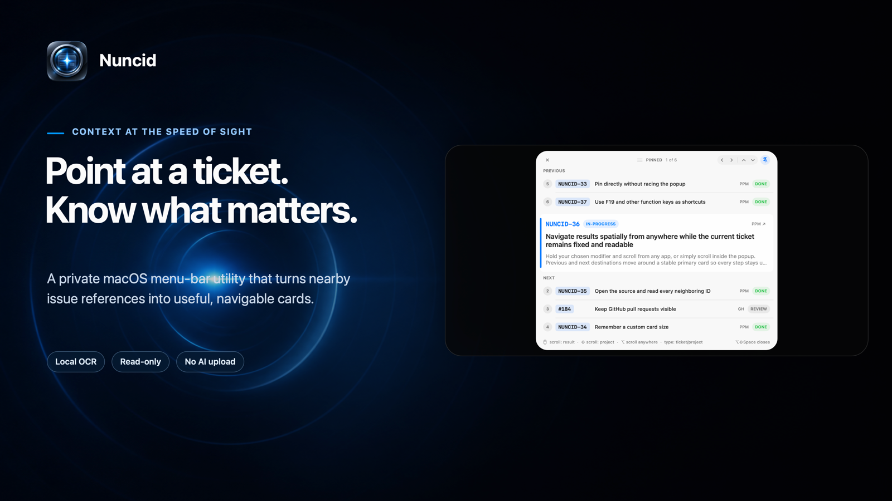
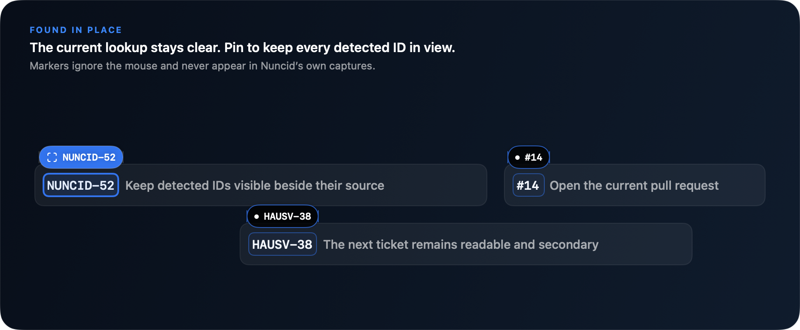
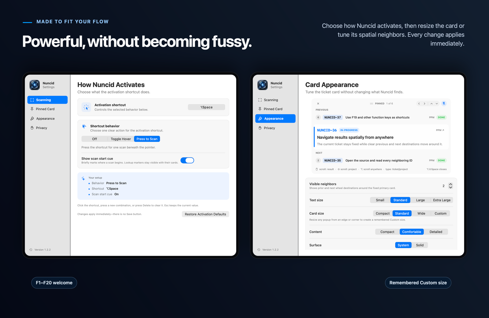
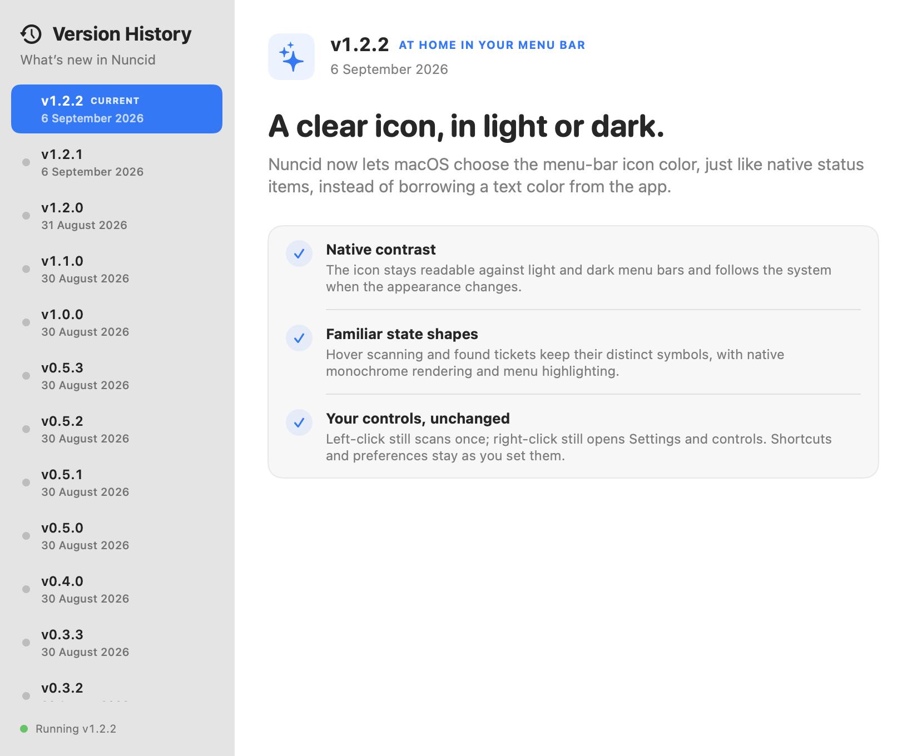

<p align="center">
  
</p>

<p align="center">
  <a href="https://github.com/markus-barta/nuncid/releases/latest"></a>
  
  
  
  
  <a href="LICENSE"></a>
</p>

<p align="center">
  <strong>Ticket context, right where you point.</strong><br>
  <strong>Nuncid</strong> (pronounced <strong>NUN-sid</strong>, formerly Glint) is a private macOS menu-bar utility that turns nearby issue references into useful, navigable cards.
</p>

<p align="center">
  <a href="https://github.com/markus-barta/nuncid/releases/latest"><strong>Download the latest release</strong></a>
  &nbsp;·&nbsp;
  <a href="#build-from-source">Build from source</a>
  &nbsp;·&nbsp;
  <a href="CHANGELOG.md">Release history</a>
</p>

## Look once. Keep moving.

Nuncid watches a small area around the pointer, recognizes ticket keys and numbers with Apple Vision, and resolves only real matches through your existing Paimos and GitHub sessions. The strongest result gets the space it deserves—key, state, title, metadata, and useful detail—while the next likely matches remain visible before you scroll.

<p align="center">
  
</p>

| Invoke anywhere | Keep context nearby | Navigate without friction |
| --- | --- | --- |
| The **activation shortcut** can stay off, toggle hover scanning, or scan once when pressed. Toggled hover scans each newly settled pointer location once—never in a timer loop. | Move into a temporary card without racing it, pin or unpin directly, and resize from any edge. Nuncid remembers the card’s size, position, and pin state. | Previous and next tickets move around a fixed primary card. Scroll inside it normally, or hold your chosen modifier to navigate while working in another app. |

The optional scan-start cue shows where Nuncid begins looking. Once a card appears, the active ID stays highlighted beside the exact text that produced it—even while the card is temporary—and follows result navigation without stealing focus.

When you scroll, every row follows one continuous direction while the ticket key and first title line travel between NEXT, the fixed card, and PREVIOUS. Long titles remain on one line while moving, then reveal their wrapped lines after landing—so the card never jumps.

The pinned header keeps its grab handle, pin state, and result position centered. Close directly at the left, or use the quiet arrow controls at the right to move between projects and results by mouse.

## Every card points back to its source

The active lookup arrives with a one-time luminous lock-on, then remains readable for as long as its card is visible. If you pin the card, **Show all detected IDs** can keep every ID from that scan marked in place: the selected result uses Nuncid blue, while the remaining IDs stay quiet but legible.

<p align="center">
  
</p>

These markers ignore mouse input, respect Reduce Motion, use consistent spacing around the source text, and remain excluded from screen capture. They clear as soon as a scroll, app or Space switch, or source-window change could make their saved position stale.

## Your shortcuts. Your card.

Activation and presentation are independent on purpose. Left-click the menu bar icon for one immediate scan in any shortcut mode; right-click it for Settings and the existing controls. Record any safe global shortcut, choose Off, Toggle Hover, or Press to Scan, and tune how much information the card shows. The menu bar icon shows when hover is active and confirms when it finds a ticket. Settings apply immediately; the appearance preview uses local sample data and never contacts a tracker.

| Hover off | Hover on | Ticket found |
| --- | --- | --- |
|  |  |  |

<p align="center">
  
</p>

Nuncid can show zero to six neighboring destinations and offers four text sizes, three presets plus a remembered Custom size, three content densities, and system or solid surfaces. Pinned Card settings also control the global scroll modifier and whether all detected IDs remain visible. Cards adapt their content to the available space instead of forcing every ticket into the same dimensions.

## What changed—and why it feels better

The app’s **Version History** explains each release in concise, positive human language. Open it from the menu, About window, or by clicking the version in Settings; your running version is always highlighted.

<p align="center">
  
</p>

## Smarter resolution, fewer wrong guesses

Explicit evidence wins. Nuncid combines the shape and position of nearby OCR text with GitHub URLs, the foreground app and window, the pinned card, and short-lived per-app history. It resolves strong candidates first, tries weaker fallbacks only when needed, and never fabricates a “maybe” result.

- Known PPM projects resolve through the `ppm` Paimos instance; `START` resolves through `pma`.
- Explicit GitHub pull-request URLs route directly to their repository.
- Bare numbers use nearby project text and foreground context before trying cautious fallbacks.
- GitHub lookups are limited to configured repositories or an explicit `github.com` URL. Ordinary OCR paths never become network targets.
- Only high-confidence or directly confirmed context is learned; weak guesses are not.

## Private by construction

The screen crop and Apple Vision OCR stay in the Nuncid process. No screenshot is saved or uploaded. No pixels, OCR text, or ticket content are sent to an AI model, and there is no telemetry.

Nuncid launches only local, read-only commands:

```text
paimos --instance <ppm|pma> --json issue get <key>
gh pr view … --json …
```

Those tools may contact their configured services using your existing credentials. Nuncid never writes to either service. Scan and lookup-marker panels opt out of screen capture, and the only learned hint is a bounded, decaying project association keyed by application bundle identifier. Settings can clear it together with cached titles.

Nuncid also makes an infrequent, bounded, read-only HTTPS request to GitHub's public latest-release endpoint for `markus-barta/nuncid`. It sends no credentials, screenshots, OCR text, ticket content, or telemetry; it accepts only a stable semantic-version tag and its matching canonical GitHub release URL. Offline or invalid responses simply leave update status unavailable.

## Install

1. Download the current build from [Latest Release](https://github.com/markus-barta/nuncid/releases/latest).
2. Move `Nuncid.app` to `~/Applications` or `/Applications`.
3. Open Nuncid. Public GitHub builds are currently locally signed and not notarized, so macOS may block the first launch. If it does, open **System Settings → Privacy & Security**, find the Nuncid notice, and choose **Open Anyway**. Only override this protection for the app downloaded from this repository’s release page; Apple explains the same process in [Open a Mac app from an unknown developer](https://support.apple.com/guide/mac-help/open-a-mac-app-from-an-unknown-developer-mh40616/mac).
4. Grant Screen Recording when macOS asks.
5. Make sure `paimos` and/or `gh` are authenticated for the sources you use.

Default commands:

| Command | Shortcut | Behavior |
| --- | --- | --- |
| Activation | `⌥Space` | Follow the selected behavior; Press to Scan is the default. |
| Pin / direct open | `⇧⌥Space` | Open pinned, pin the temporary card, focus it, or close it. |

Both shortcuts are fully configurable. F1 through F20 work without modifiers; regular keys require a safe global modifier. The native recorder reports unsafe choices and conflicts directly in Settings.

## Pinned navigation

| Input | Result |
| --- | --- |
| Mouse wheel | Select another resolved ticket. |
| `⇧` + mouse wheel | Keep the number and try another project. |
| Chosen modifier + wheel, anywhere | Select another result while any app remains active. |
| Type digits | Jump to a ticket number while keeping the project. |
| Type letters | Fuzzy-match a project; the best guess previews immediately. |
| Paste `PHAROS-203`, `#203`, or `203` | Resolve a full key, pull request, or number directly. |
| Return | Apply the previewed input. |
| Escape | Clear the current input, then close. |

Typing is captured only while the pinned card is focused. Global wheel navigation is passive: Nuncid responds to the configured modifier without consuming the active app’s scroll event.

## Build from source

You need macOS 13 or newer, a Swift 5.10 toolchain, and authenticated `paimos` / `gh` installations for the sources you want to resolve.

```sh
swift build
./scripts/test.sh
./scripts/package-app.sh
open dist/Nuncid.app
```

The packaging script stages `dist/Nuncid.app` outside SwiftPM's cleanable build directory. It derives the build number from Git history and, by default, applies a stable local designated requirement so Screen Recording permission survives rebuilds without a paid signing identity. The package records whether it was signed locally or with Developer ID; signature verification is not presented as notarization.

All menu-bar states use native monochrome template rendering: macOS chooses
contrast for the current menu-bar background and menu highlighting. Hover and
match states remain distinguishable by shape, without forcing accent or text
colors from the app's appearance.

## Update compatibility (NUNCID-58)

**1.2.1 is a SemVer bridge, not the calendar cutover.** Install it before moving
to future date-based releases. The 1.2.0 checker rejects zero-padded calendar
tags and cannot discover them; its path is 1.2.0 → 1.2.1 → calendar. Keep the
[1.2.1 bridge release](https://github.com/markus-barta/nuncid/releases/tag/v1.2.1)
available for older installations even after the latest release changes.
The 1.2.1 bridge's frozen legacy inventory does not recognize the later 1.2.2
hotfix: download 1.2.2 directly if its checker reports unavailable. Calendar
releases remain gated; the last legacy anchor is now 1.2.2.

The bridge recognizes only the explicit legacy release inventory without
metadata. Future calendar releases require exactly one closed
`nuncid-release-metadata` HTML comment in their GitHub release body, containing
`version-scheme: inspr-calendar-v1`, `version: <canonical coordinate>`,
`release-channel: stable`, and `release-sequence: <ordinal>`. The sequence must
start at 19 after the 1.2.2 appearance hotfix (legacy sequence 18); 1.2.1
remains sequence 17. Missing, malformed, unknown, or
inconsistent metadata makes update status unavailable rather than guessing.
Calendar date order and sequence order must agree; an older release is never
offered as an update. This check links to downloads; it does not install them.

The first calendar coordinate is **not yet reserved**. Calendar publishing,
its immutable release-set manifest, macOS bundle-version mapping, and exact
artifact rollback remain gated by NUNCID-58. Legacy parsing stays supported
until a separately approved compatibility-window closeout.

## Release and visual workflow

[`VERSION`](VERSION) is the source of truth for the packaged version; [`CHANGELOG.md`](CHANGELOG.md) keeps the user-visible history.

```sh
./scripts/bump-version.sh patch "Short user-visible release summary"
```

Add the matching benefit-led entry to `ReleaseHistory.swift`, then capture and compose the new interface before running consistency-gated tests:

```sh
./scripts/capture-release-shots.sh
swift scripts/render-marketing-shots.swift
./scripts/test.sh
./scripts/package-release.sh
./scripts/verify-release.sh
```

The capture script opens DEBUG-only visual probes long enough to save the current pinned card, Scanning, Appearance, and light/dark Version History. The compositor reads `VERSION` and rebuilds the README hero, feature gallery, and social preview from those same-version captures plus the checked-in scan-field artwork. Historical GLINT captures and the [0.3.0 visual comparison](docs/compare-0.3.0.html) remain unchanged so the release record stays truthful. The [rename decision and migration record](docs/nuncid-rename-2026-08-30.md) documents the collision screen and compatibility choices.

Developer ID distribution is opt-in and requires credentials already stored in your macOS keychain. Apple requires Developer ID, hardened runtime, a secure timestamp, notarization, and a stapled ticket for the trusted distribution path; see [Apple’s notarization guidance](https://developer.apple.com/documentation/security/notarizing-macos-software-before-distribution).

```sh
NUNCID_SIGNING_IDENTITY='Developer ID Application: Example (TEAMID)' \
NUNCID_NOTARY_PROFILE='nuncid-notary' \
./scripts/package-release.sh
NUNCID_EXPECT_NOTARIZED=1 ./scripts/verify-release.sh
```

Without those variables, packaging remains deliberately local/ad-hoc and verification says so. CI uses that credential-free path and never publishes an artifact. Complete Swift strict-concurrency checking is reserved for the Swift 6 migration; 1.0 remains in Swift 5 language mode and treats all warnings in its supported build mode as errors.

## Project map

```text
Sources/Nuncid/              App, OCR, parsing, resolution, shortcuts, and UI
Sources/Nuncid/Resources/    Packaged visual assets
Fixtures/                    Deterministic hover/OCR test material
docs/screenshots/            Raw product captures and rendered marketing images
scripts/test.sh              Build, self-tests, and versioning regression checks
scripts/check-release-consistency.sh
                             README, changelog, history, and visual version parity
scripts/capture-release-shots.sh
                             Reproducible raw Settings, card, and history captures
scripts/package-app.sh       Release build, app bundle, metadata, and local signing
scripts/package-release.sh   Signed app plus versioned release archive
scripts/verify-release.sh    Signature, archive, metadata, and portable smoke checks
scripts/bump-version.sh      Semantic version and changelog update
scripts/render-marketing-shots.swift
                             Reproducible GitHub image compositor
```

Nuncid is deliberately small, local-first, and read-only. Those are product constraints, not missing features.

## License

Nuncid is open-source software licensed under the [GNU Affero General Public License v3.0](LICENSE). The complete terms are included in the repository and inside every packaged app.

Copyright © 2026 Markus Barta.
